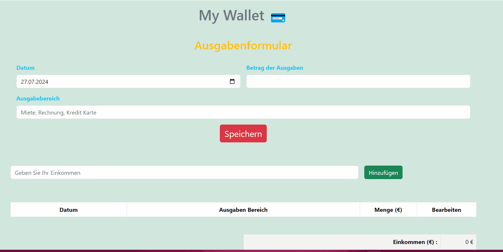

# My Wallet App

This is a simple Wallet application built with HTML, CSS, Bootstrap and JavaScript. The app allows users to add income values, track expenses, and automatically calculate the remaining balance. It provides an easy way to manage personal finances.

## Features

- **Add Income**: Users can input and save their income values.
- **Track Expenses**: Users can add and track their expenses.
- **Calculate Balance**: The app automatically calculates the remaining balance after subtracting expenses from the total income.

## Technologies Used

- **HTML**
- **CSS**
- **JavaScript**
- **Bootstrap**

## Project Structure

Wallet-App/
│
├── app.js
├── index.html
├── style.css
└── my-wallet-app.gif

- **app.js**: Contains the JavaScript code for the Wallet app.
- **index.html**: The main HTML file that contains the structure of the Wallet app.
- **style.css**: Contains the CSS styles for the Wallet app.
- **my-wallet-app.gif**: A GIF demonstrating the functionality of the Wallet app.

## Demo

https://ayseugurlu.github.io/Wallet-App/

## Example

## License

This project is licensed under the MIT License.

